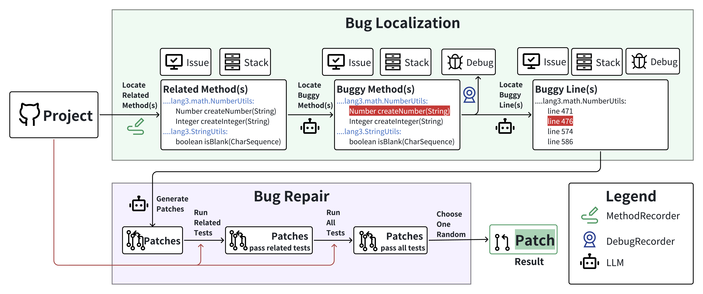

# DEVLoRe



Our experimental data is available at [release page](https://github.com/XYZboom/DEVLoRe/releases/download/v0.0.1-pre/DEVLoRe-Data.zip)

Useful links: [MethodRecorder](https://github.com/XYZboom/MethodRecorder), [DebugRecorder](https://github.com/XYZboom/DebugRecorder)
## How to use

- [x] **Step 1. Clone project**

```bash
git clone https://github.com/XYZboom/DEVLoRe.git
```

- [x] **Step 2. Install python requirements**

```bash
pip install -r requirements.txt
```

- [x] **Step 3. Prepare [Defects4j](https://github.com/rjust/defects4j) environment**

Just follow the readme in Defects4j ([https://github.com/rjust/defects4j](https://github.com/rjust/defects4j))

Note that we currently support Defects4j **v2.0.0** only.

- [x] **Step 4. Download tools**

Download tools from [release page](https://github.com/XYZboom/DEVLoRe/releases/).

- [x] **Step 5. Setup environment variables**
- Create a ".env" file at the root of this project.
- Set environment variables like this:

```text
OPENAI_API_KEY=your_openai_api_key
DEFECTS4J_EXEC=/path/to/defects4j/framework/bin/defects4j
OUTPUT_PATH=where_to_output
D4J_JSON_PATH=where_to_find_baseline_buggy_locations
EXTRACT_JAR_PATH=/path/to/RelatedMethodExtractor.jar
```

- [x] **Step 6. Run data preparation scripts**

After you finish the setup of Defects4J, you can see an "ant" file
at {Defects4J_HOME}/major/bin/ant.
Add MethodRecorder as a java agent commandline argument in this file.
**Remember to back up this file!**

```bash
#!/bin/sh
# This is not a script to directly run! 
# This is a example how to add MethodRecorder as a java agent in Defects4J
BASE="`dirname $0`/.."

if [ -z "$JAVA_HOME" ]; then
    CMD="java"
else
    CMD="$JAVA_HOME/bin/java"
fi

# Add this "-javaagent:..." line
$CMD \
    -javaagent:/path/to/MethodRecorder.jar=./temp.properties -Xverify:none \ 
    -XX:ReservedCodeCacheSize=256M \
    -XX:MaxPermSize=1G \
    -Djava.awt.headless=true \
    -Xbootclasspath/a:$BASE/config/config.jar \
    -jar $BASE/lib/ant-launcher.jar $*
```
After this, run [ExtractSkeleton.py](src/ExtractSkeleton.py) to get method skeleton.

- [x] **Step 7. Run modules**

- Locate buggy method

```bash
python LocateMethod.py --add-issue-info=True --add-stack-info=True
# --add-issue-info=True add issue info in prompt
# --add-stack-info=True add stack info in prompt
```

Issue information should put in {OUTPUT_PATH}/issue_content.
You can find issue content extract by us in our data zip file.
You can also extract issue content by your own, for example, 
issue url of project "Lang" in Defects4J is located at 
[here](https://github.com/rjust/defects4j/blob/master/framework/projects/Lang/active-bugs.csv).

- Extract buggy method content

Run [ExtractMethodAndField.py](src/ExtractMethodAndField.py) to extract buggy method content.

The commandline arguments must be same as the ones when running [LocateMethod.py](src/LocateMethod.py).

That is: if you run [LocateMethod.py](src/LocateMethod.py) with "--add-issue-info=True" and without "--add-issue-info=True",
then you must run [ExtractMethodAndField.py](src/ExtractMethodAndField.py) with "--add-issue-info=True" and without "
--add-issue-info=True".

- Extract debugging information

If you don't want provide debugging information, just see the next step "Locate buggy line".

After you finish the setup of Defects4J, you can see an "ant" file
at {Defects4J_HOME}/major/bin/ant.
Add DebugRecorder as a java agent commandline argument in this file.
**Remember to back up this file!**

```bash
#!/bin/sh
# This is not a script to directly run! 
# This is a example how to add DebugRecord as a java agent in Defects4J
BASE="`dirname $0`/.."

if [ -z "$JAVA_HOME" ]; then
    CMD="java"
else
    CMD="$JAVA_HOME/bin/java"
fi

# Add this "-javaagent:..." line
$CMD \
    -javaagent:/path/to/DebugRecorder.jar=./temp.properties -Xverify:none \ 
    -XX:ReservedCodeCacheSize=256M \
    -XX:MaxPermSize=1G \
    -Djava.awt.headless=true \
    -Xbootclasspath/a:$BASE/config/config.jar \
    -jar $BASE/lib/ant-launcher.jar $*
```
Run [ExtractDebugInfo.py](src/ExtractDebugInfo.py) with same commandline arguments above.
- Locate buggy line
```bash
python LocateLine.py --add-issue-info=True --add-stack-info=True --add-debug-info=True
# --add-debug-info=True add debugging info in prompt
```
- Repair
```bash
python Repair.py --add-issue-info=True --add-stack-info=True --add-debug-info=True
```
- Evaluate
**RESTORE "ant" file to its ORIGINAL STATE before evaluate!**
```bash
python Evaluate.py --add-debug-info=True
  --patch-valid=False
  --add-issue-info=True
  --add-stack-info=True
# set --patch-valid=True to extract patches from evaluate result.
```
